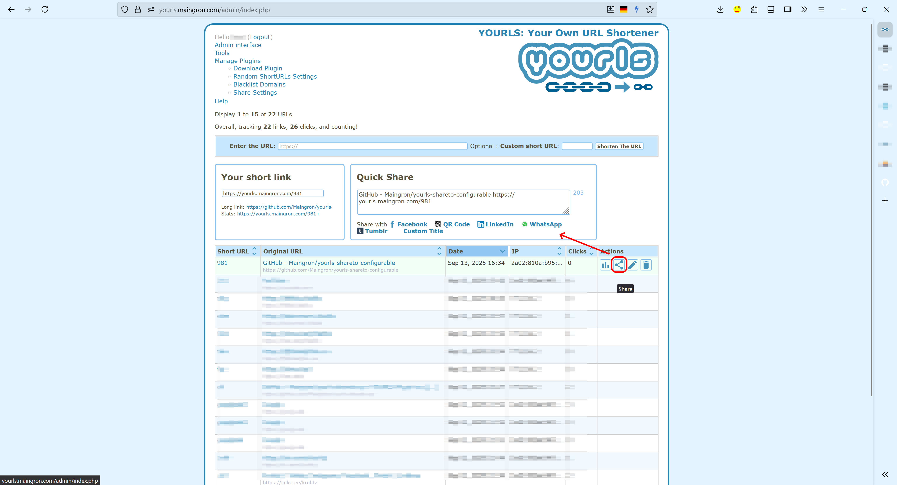

# Share to - Configurable

[](https://yourls.org/)


Plugin Page: [Maingron/yourls-shareto-configurable](https://github.com/Maingron/yourls-shareto-configurable)

## Description

**Share to - Configurable** is a [YOURLS](https://yourls.org/) plugin that allows you to add customizable sharing options to your YOURLS installation. Share your short URLs to various platforms like LinkedIn, Tumblr, and more, with configurable settings for each platform.  

This plugin is also linked in the plugin section of the official [YOURLS/awesome repo](https://github.com/YOURLS/awesome?tab=readme-ov-file#s).

## Features

- Enable or disable sharing options for specific platforms.
- Customize titles, platform link templates, and icons for each sharing option.
- Configure popup window dimensions for sharing dialogs.
- Supports QR codes, E-Mails, LinkedIn, other platforms, plus up to 4 custom sharing options.

## Installation

1. Download or clone this repository into your YOURLS `user/plugins` directory:
   ```bash
   git clone https://github.com/Maingron/yourls-shareto-configurable.git yourls-shareto-configurable
   ```
2. Activate the plugin from the YOURLS admin interface.

## Configuration

1. Navigate to the plugin settings page in the YOURLS admin interface.
2. Configure the sharing options:
   - Enable or disable specific platforms.
   - Set titles, platform link templates, and icons.
   - Define popup window dimensions.
3. Save your settings.

## Supported Platforms

- **QR Code**
- **E-Mail**
- **LinkedIn**
- **Tumblr**
- **WhatsApp**
- **Custom Sharing Options** (up to 4)

## Replaces

This plugin **replaces** the following YOURLS plugins or functionalities:

- **QR Code Plugin**: [Maingron/yourls-shareto-qr](https://github.com/Maingron/yourls-shareto-qr)
- **E-Mail Sharing Plugin**: [peterberbec/yourls-mailto](https://github.com/peterberbec/yourls-mailto)
- **Tumblr Sharing Plugin**: [Gist by ozh](https://gist.github.com/ozh/25b2074dd275ed091aa1869200894c4d)
- **WhatsApp Sharing Plugin**: [wissehes/Whatsapp-quickshare](https://github.com/wissehes/Whatsapp-quickshare)
- **LinkedIn Sharing Plugin** [popnt/yourls-linkedin-share](https://github.com/popnt/yourls-linkedin-share)
- **Disabling Sharing Altogether**: [seandrickson/YOURLS-Remove-the-Share-Function](https://github.com/seandrickson/YOURLS-Remove-the-Share-Function/blob/master/plugin.php)

## Screenshots




## Contributing

Contributions are much appreciated! Feel welcome to submit issues or pull requests.  
If your PR improves the plugin, either by adding or fixing code, or by adding a new translation, that's great!

### Support

If you find this plugin useful, please consider sharing it on social media :)  
Of course, you can also always [donate](https://maingron.com/donate) or contribute to the codebase.

## License

This plugin is licensed under the MIT License. See the [LICENSE](LICENSE) file for details.

## Author

Developed by [Maingron](https://maingron.com).
